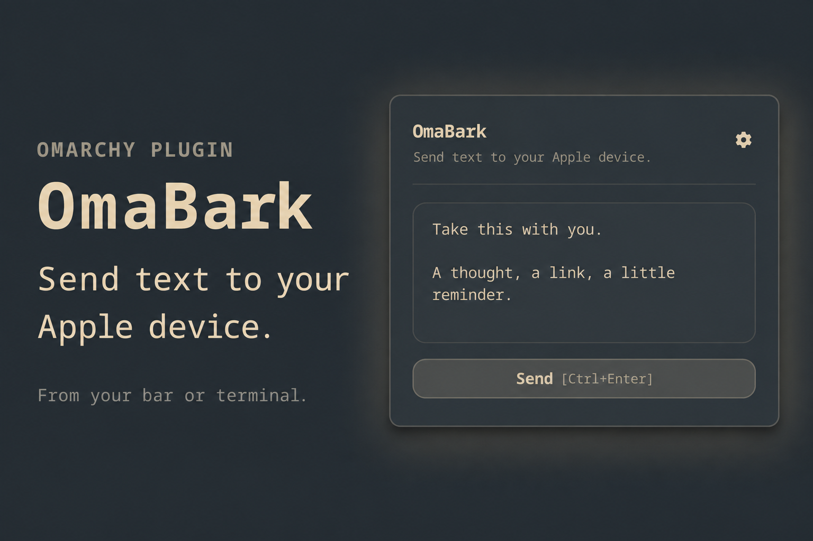

# OmaBark

Send text from your Omarchy bar to your Apple device with [Bark](https://github.com/Finb/Bark).
A small, theme-aware panel for the things you want to take with you.

The name combines **Omarchy + Bark**.



## Features

- Type or explicitly paste text, then send with **Ctrl+Enter**.
- Send from a terminal or pipe using `omabark send`, without a running desktop shell.
- Configure a reusable notification title; blank uses **From Omarchy**.
- One saved Apple device, ready whenever you need it.
- Add a device using the test URL copied from Bark, or a server URL and device key.
- Use the public Bark server or your own HTTPS server, including a base path.
- Long text is sent in numbered parts, preserving Unicode and line breaks.
- Clear server-acceptance and partial-failure feedback; a failed send keeps your draft.
- Native Omarchy bar, panel, buttons, dropdown and theme tokens. No background polling.

## Requirements

Omarchy Quattro with the schema-v1 plugin API and current `qs.Ui` components,
Quickshell, Qt Quick Controls/Layouts, Python 3.10+ (`/usr/bin/python3`), and
GNU coreutils (`/usr/bin/timeout`). No pip packages, curl, daemon, system service,
root access or downloaded code are required. Install Bark on a compatible Apple
device, enable notifications there, and copy its test URL.

The optional open-and-paste shortcut additionally needs `wl-clipboard`
(`/usr/bin/wl-paste`) and a Wayland session.

This repository targets the currently installed Quattro API. It does not claim
compatibility with proposed future plugin security schemas or marketplace approval.

## Installation

```sh
omarchy plugin add https://github.com/NeroSong/omabark
```

### From a local checkout

From this repository's root, after reviewing the source:

```sh
omarchy plugin validate .
mkdir -p "$HOME/.config/omarchy/plugins"
test ! -e "$HOME/.config/omarchy/plugins/nerosong.omabark" && \
  cp -R . "$HOME/.config/omarchy/plugins/nerosong.omabark"
omarchy-shell shell rescanPlugins
omarchy plugin enable nerosong.omabark
```

The copy step deliberately avoids replacing an existing installation. During
development edit that user-owned copy, or copy reviewed updates explicitly.
Plugin discovery rejects symlinks; do not symlink the project directory.

Click the OmaBark icon, optionally set a notification title, paste the test URL and click **Test and Save**. A test notification must be accepted
by Bark before the device is saved; failure keeps the form open. For servers
behind a path prefix, choose **Custom server** from the server dropdown below the notification title and enter the full
base URL (for example `https://push.example.org/bark`) separately from the key.
Do not append `/push` to the server base URL.

Use Ctrl+V to paste into the editor. Enter inserts a newline; Ctrl+Enter
sends. Escape, clicking outside, or clicking the bar icon again dismisses the panel.
There is no separate Close button. Drafts survive closing the panel but
are kept only in memory and disappear on shell reload. Successful sends clear
the draft. The gear icon beside the heading opens configuration. Back replaces the gear at the
top right of configuration. The full-width Send button includes a dimmer
secondary-color shortcut hint in square brackets. Send status is centered and compact; hover over
a failure status for its details.

### Notification title and device configuration

Set the notification title above the server selector. Leaving it blank uses
**From Omarchy**, including for the test notification. This title persists with
the device in private storage and is reused by every send; the former
`notificationTitle` bar setting is no longer used.

Only one device is active. **Test and Save** tests the proposed configuration
before replacing the saved one. A failed test leaves the previous configuration
intact. When editing the same server, leave the URL/key blank to retain its stored
key; changing servers requires a new key. Older multi-device files use their first
entry without rewriting the file on read; the next successful save replaces the
list with the single tested device.

```sh
omarchy-shell shell summon nerosong.omabark '{}'
omarchy-shell shell hide nerosong.omabark
omarchy bar move nerosong.omabark --section right
omarchy plugin disable nerosong.omabark
omarchy plugin remove nerosong.omabark
```

The summon command can also be assigned to a shortcut using your normal Omarchy
keybinding configuration. Installation does not add or replace keybindings.

### Optional keyboard shortcuts

OmaBark exposes these commands for your own keybindings:

```sh
# Open the panel without changing the current draft.
omarchy-shell shell summon nerosong.omabark '{}'

# Open and replace the draft with clipboard text; never send automatically.
omarchy-shell nerosong.omabark paste
```

For example, add bindings manually to `~/.config/hypr/bindings.lua`, choosing
unused combinations that suit your setup:

```lua
o.bind("SUPER + ALT + B", "Open OmaBark", "omarchy-shell shell summon nerosong.omabark '{}'")
o.bind("SUPER + ALT + SHIFT + B", "Paste into OmaBark", "omarchy-shell nerosong.omabark paste")
```

The plugin must be enabled. The paste command uses the bar's monitor-selection
logic, reads text once, and puts it into the composer. Review it, then press
**Ctrl+Enter** or **Send**. If a request is already running, paste is ignored.
Empty, non-text, invalid UTF-8, oversized or timed-out clipboard reads leave
the existing draft intact. With no configured device, complete setup first;
the pasted draft is retained for the composer. Clipboard reads are limited to
32,000 UTF-8 bytes and three seconds.

This follows the explicit paste IPC pattern used by
[Text Transform](https://github.com/jankeesvw/omarchy-text-transform#readme).
These are reference examples only: OmaBark does not install bindings, modify
Hyprland configuration, or provide a setup script. Ordinary open never reads
the clipboard, and paste never sends a notification.

## Command line

The repository includes an executable `omabark`. After installing the plugin,
add the command to your user bin directory (the link stays outside the plugin):

```sh
mkdir -p "$HOME/.local/bin"
ln -s "$HOME/.config/omarchy/plugins/nerosong.omabark/omabark" "$HOME/.local/bin/omabark"
```

The command expects `~/.local/bin` on PATH. The link command refuses to replace
an existing path. You can also run `./omabark` directly from this repository.

```sh
omabark send "Build completed"
printf '%s\n' 'First line' 'Second line' | omabark send
omabark send < notes.txt
omabark send --json "Build completed"
omabark send -- "--text beginning with a dash"
omabark send --help
```

An omitted message (or `-`) reads UTF-8 from stdin. It preserves newlines,
including the final newline. Quote messages passed as arguments. Argument text
can appear in shell history and process arguments; use stdin for private text.
Empty, invalid UTF-8 and oversized input are rejected before sending.

The CLI uses the same saved device, title, splitting, TLS checks and no-retry
behavior as the panel. Configure once through **Test and Save** first. No GUI,
Wayland session, clipboard access or running Omarchy shell is needed to send.
Keys are loaded by the existing worker and never passed in command arguments.

Exit status is `0` when every part is accepted by Bark, `1` on failure (including
partial acceptance), `2` for command usage errors, and `130` on interruption.
Normal failures go to stderr. `--json` writes the result to stdout for scripts,
with `ok`, and `sent`/`total` when available. An interrupted or timed-out send
may already have reached the server; the CLI reports delivery as unconfirmed.

Removing the plugin leaves this command link dangling. Remove the link with
`rm "$HOME/.local/bin/omabark"` when uninstalling the command.

## Limits and delivery

Messages can contain up to **32,000 UTF-8 bytes**; titles up to **120 UTF-8 bytes**.
Each part holds up to 1,800 bytes of JSON-encoded text to leave room for notification
metadata. Text is never silently truncated. Numbered parts are separate notifications;
arrival order depends on Bark/APNs. No automatic retry is performed. If a connection
fails after acceptance, delivery can be uncertain: check the device before retrying.

Success means **Bark returned code 200**, not that the device displayed the message.
Focus modes, notification settings, APNs and connectivity can affect display.
Each request has an 8-second socket timeout; a send stops starting new parts after
120 seconds. The worker has its own 165-second alarm, an outer 170-second
process deadline with forced termination two seconds later, and a GUI watchdog.
All worker and clipboard I/O runs in asynchronous child processes, outside the
desktop shell event loop. Startup failure releases the busy state immediately;
timeout cleanup keeps it locked until the worker exits, preventing overlapping
requests. These bounds do not confirm delivery of a request already accepted.

## Privacy and storage

Omarchy community plugins run as unsandboxed code with your user permissions.
Review the source before installation. See [SECURITY.md](SECURITY.md) for the
trust boundaries and [VALIDATION.md](VALIDATION.md) for the local review scope.

Device keys live in `$XDG_CONFIG_HOME/omabark/devices.json`, falling back to
`~/.config/omabark/devices.json`. The directory is `0700` and files are `0600`.
The worker uses bounded reads, no-follow file opens, a lock and atomic replacement.
Keys are plaintext under these filesystem permissions, not encrypted in a keyring.
Exclude this directory from public dotfile repositories and shared backups.
Plugin removal leaves it intact; delete it separately if you want to forget devices.

The GUI and CLI pass messages and keys to a one-shot Python worker through stdin,
never shell interpolation. The CLI itself also accepts explicitly provided message
arguments as documented above. Only explicit Send, Test and Save, and `omabark send` actions perform network I/O:
JSON POST to the chosen server's `/push` endpoint over certificate-verified HTTPS.
HTTP redirects are rejected; no response bodies, keys or messages are logged.
Python honors system proxy environment variables. There is no telemetry, clipboard
monitor, or local message history. The chosen Bark server receives the plaintext
message inside TLS; this plugin does not implement Bark's optional encrypted push.

## Development and verification

```sh
python3 -m unittest discover -s tests -v
omarchy plugin validate .
python3 tests/smoke.py   # active Wayland session; briefly opens a test panel
python3 tests/failures.py # isolated QML fault injection; no real network or clipboard
```

The smoke test uses temporary device storage and a dummy device, loads the actual
plugin, exercises the QML/Python save/list/remove protocol, and opens/closes the
panel twice. Its disposable worker has a stubbed HTTP transport; it neither installs the plugin
nor sends a real notification.

See [VALIDATION.md](VALIDATION.md) for the tested scope and remaining acceptance
checks. `preview.png` is a promotional composition made with image generation
from a real Wayland screenshot of the actual composer using harmless sample
text. The original screenshot is [assets/composer.png](assets/composer.png).
Neither image is evidence of iPhone delivery.

## License

OmaBark is released under the [MIT License](LICENSE). You may use, modify and
redistribute it under those terms. The software is provided without warranty.

The monochrome bar mark uses original geometry inspired by the opposing speaker
shapes in the [Bark app icon](https://apps.apple.com/app/id1403753865).

The bar/panel lifecycle follows Omarchy's MIT-licensed examples. This is an
independent community plugin, not an official Bark or Omarchy product.
